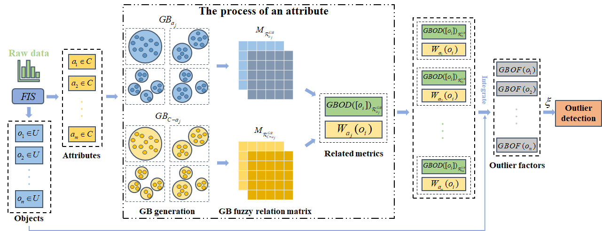

# GBFRD
Xinyu Su, **Zhong Yuan***, Baiyang Chen, Dezhong Peng, Hongmei Chen, and Yingke Chen,[Detecting anomalies with granular-ball fuzzy rough sets](Paper/2024-GBFRD.pdf), Information Sciences, June 2024, DOI: [10.1016/j.ins.2024.121016](https://doi.org/10.1016/j.ins.2024.121016). (Code)

## Abstract
Most of the existing anomaly detection methods are based on a single and fine granularity input pattern, which is susceptible to noisy data and inefficient for detecting anomalies. Granular-ball computing, as a novel multi-granularity representation and computation method, can effectively compensate for these shortcomings. We utilize the fuzzy rough sets to mine the potential uncertainty information in the data efficiently. The combination of granular-ball computing and fuzzy rough sets takes into account the benefits of both methods, providing great application and research value. However, this novel combination still needs to be explored, especially for unsupervised anomaly detection. In this study, we first propose the granular-ball fuzzy rough set model, and the relevant definitions in the model are given. Subsequently, we pioneeringly present an unsupervised anomaly detection method based on granular-ball fuzzy rough sets called granular-ball fuzzy rough sets-based anomaly detection (GBFRD). Our method introduces the granular-ball fuzzy rough granules-based outlier factor to characterize the outlier degree of an object effectively. The experimental results demonstrate that GBFRD exhibits superior performance compared to the state-of-the-art methods. The code is publicly available at https://github.com/Mxeron/GBFRD.

## Framework


## Usage
You can run GBFRD.py:
```
if __name__ == '__main__':
    load_data = loadmat('./Datasets/arrhythmia_variant1.mat')
    trandata = load_data['trandata']
    data = trandata[:,:-1]
    label = trandata[:,-1]
    scaler = MinMaxScaler()
    X = scaler.fit_transform(data)
    sigma = 0.0
    out_factor = GBFRD(X, sigma)
```

## Citation
If you find GBFRD useful in your research, please consider citing:
```

```
## Contact
If you have any questions, please contact suxinyu@stu.scu.edu.cn.
